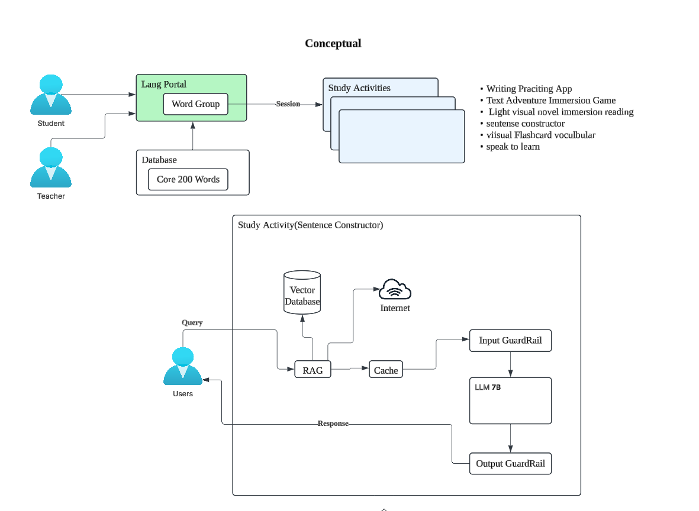

## Functional Requirements

The comppany want to invest in owing their infrastructure.
The reason is because there is concern about privacy of user data and also a conern that the cost of managed service for GenAI will greatly raise is cost

They want to invest an AI PC where they can afford spedn of 10-15K
They have 300 active students and students are located within the city of kotokuu

## Assumptions

We are assuming that the Open-source LLM that we choose will be powerfull enough to run on hardware with an investment of 10-15k.
we are just going to hook up a single serve in our office to the internet and we should have enough band width to serve the 300 students

## Data Strategy

There is a concerned of copyrighted material, so we must purchase and supply materials and store them for access in ourr database

## Conceptual Architecture

## Considerations

- we are considering using IBM Granite because its a truely open-source model with training data that is traceable so we can avoid any copyright issues and we are able to know what is going in the model
  https://huggingface.co/ibm-granite
