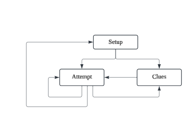
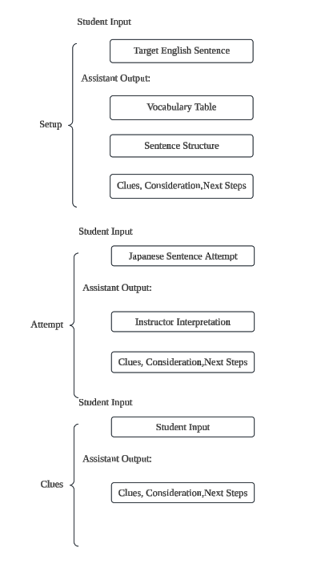

# Sentense Constructor

## Work flow

This diagram shows a general feedback loop for the learning process:

1. **Setup**:

   - The foundational stage where the necessary resources and information are provided.
   - It prepares the learner with clues, vocabulary, sentence structure, and other guidance.

2. **Attempt**:

   - The learner takes an action or attempts to produce the desired output (e.g., a Japanese sentence).
   - This stage involves the practical application of the Setup material.

3. **Clues**:
   - If the learner's attempt is incomplete or incorrect, they are provided with clues or feedback.
   - These clues guide the learner back to revisiting their attempt, using insights gained from the Setup.
   - This cycle repeats until the learner successfully completes the task.

The arrows in this diagram demonstrate the iterative nature of the process, where the learner cycles through these stages.

## Setup, Attempt & Clues flow

This diagram breaks down the three stages in detail, showing the specific roles of the **Student Input** and **Assistant Output** at each step:

#### **Setup**:

- **Student Input**: The target English sentence is given (the goal for translation or understanding).
- **Assistant Output**:
  - A vocabulary table with key words or phrases.
  - Sentence structure, providing grammar rules or syntax.
  - Clues, considerations, and next steps to guide the learner.

#### **Attempt**:

- **Student Input**: The learner attempts to construct a Japanese sentence based on the Setup.
- **Assistant Output**:
  - The instructor interprets or evaluates the learner's attempt.
  - Provides clues and feedback, including further considerations or next steps to refine the attempt.

#### **Clues**:

- **Student Input**: The learner provides additional input or responds to feedback.
- **Assistant Output**:
  - Provides more clues and considerations to further refine the learner's understanding or attempt.

### **Purpose**

This process ensures iterative learning with actionable feedback. It emphasizes continuous improvement, where the student uses guidance (Setup) to attempt (Attempt), and receives targeted feedback (Clues) to improve their skills effectively.
